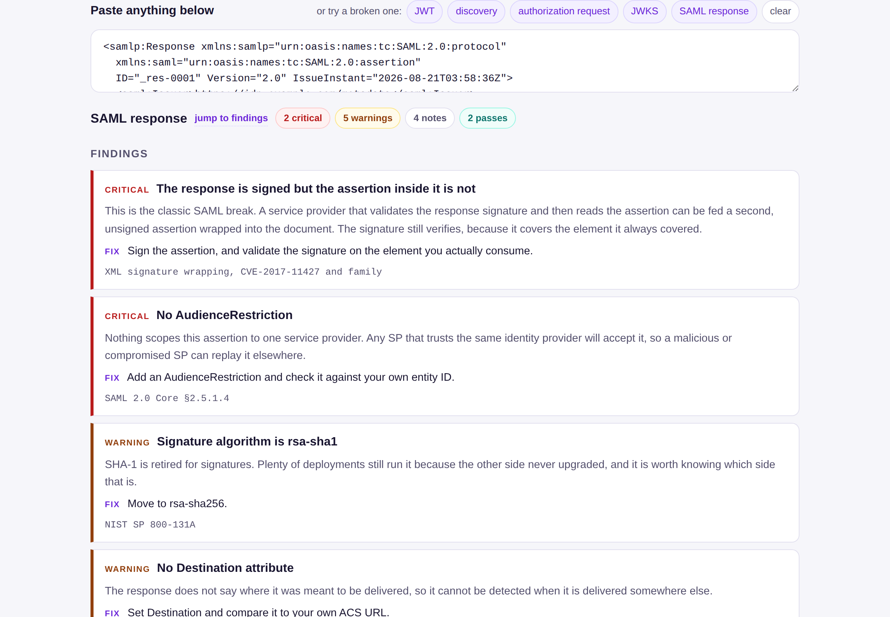

# authlint

**Paste any artifact from an authentication flow, decode it, and see what is wrong with it.**

[Use it →](https://roniam.dev/authlint/) · [Full guide →](USAGE.md)



authlint reads JSON Web Tokens (including DPoP proofs and JWEs), JWKS documents,
OpenID Connect discovery documents, OAuth 2.0 authorization requests and
redirects, token endpoint and introspection responses, `Set-Cookie` headers,
SAML responses, requests, logout messages and metadata — redirect-binding SAML
included, inflated in the browser. You do not tell it which one you have. It
works that out, decodes it, and then does the part the other tools skip: it
tells you what is wrong, why that matters, and what to change.

**Nothing leaves your browser.** No network calls, no storage, no analytics, no
build step. One HTML file that works with the network unplugged, because people
paste production tokens into tools like this all day and every other one is
somebody's server.

```
curl -O https://roniam.dev/authlint/index.html   # or just save the page
open index.html                                   # works offline, forever
```

## Why another one of these

The existing tools decode. Decoding is the easy half, and any of them will show
you a payload.

None of them will tell you that the response is signed but the assertion inside
it is not, which is the difference between a working federation and a signature
wrapping attack. Or that the discovery document advertises no PKCE, so every
client reading it is sending bare authorization codes. Or that `exp` is in
milliseconds, so the token expires in the year 57000. Or that the JWKS you are
serving to the public internet contains an `oct` key, and the shared secret is
sitting in the `k` parameter.

Those are the findings that cost people weekends. authlint has about a hundred
of them, and each kind of token is graded by its own rules: a DPoP proof, an ID
token, an access token and a logout token are different artifacts with
different required claims, and a checker that grades one by another's rules
produces confident nonsense.

## What it checks

**JWTs.** `alg: none` and symmetric-signing confusion. `jku`, `x5u` and `jwk`
headers, which nominate the key that validates their own token. Millisecond
timestamps, and string timestamps that make validators fail open. Lifetimes
measured in weeks. Missing `iss`, `aud` or `exp`, and a trailing slash on `iss`.
An ID token with multiple audiences and no `azp`. Email addresses used as
`sub`. Bearer tokens with no `cnf` binding. Personal data in a payload that is
base64 rather than encryption. Tokens large enough to break a header limit for
whichever user has collected the most groups. DPoP proofs get proof rules:
required `jti`/`htm`/`htu`/`iat`, the embedded key checked for private
parameters, and no complaints about the `exp` and `aud` they rightly lack.

**JWKS.** Symmetric or private key material in a document meant to be public.
Duplicate `kid` values. RSA keys under 2048 bits. Certificates about to expire.

**OpenID Connect discovery.** Missing or plain-only PKCE. Implicit flows nobody
remembers enabling — in the response types and in `grant_types_supported`,
which is where they hide. ROPC still on. Unsigned request objects. `none` in
the supported ID token algorithms. Plaintext `jwks_uri`. Trailing-slash issuer
mismatches, which cost more debugging hours than any other single character in
this field.

**OAuth authorization requests and redirects.** Missing PKCE, and the honest
version of the `state` story: with PKCE verified at the exchange, CSRF is
covered and a missing `state` is a note, not a scare. Duplicated parameters,
every copy shown. Wildcard, plaintext and look-alike redirect URIs — userinfo
`@` tricks, path traversal, nested open redirectors. A client secret traveling
through the browser. An ID token requested with no `nonce`. Tokens arriving in
a URL fragment. Callbacks without the RFC 9207 `iss`. And when a redirect
carries an ID token beside its access token or code, `at_hash` and `c_hash`
are **verified**, offline, with WebCrypto — the one cryptographic check that
needs no key.

**Token endpoint and introspection responses.** Missing `token_type` or
`expires_in`, `Bearer` casing that breaks string-matching clients, refresh
tokens without a rotation story, inactive introspection responses that leak
everything the token used to be.

**Set-Cookie.** Missing `Secure` or `HttpOnly`, `SameSite=None` without
`Secure` (the browser drops it, silently), broken `__Host-` prefix contracts,
month-long session cookies, JWTs riding in cookies.

**SAML.** Which element the signature actually covers — each `Reference` is
resolved, so a signature that points at an element other than the one it lives
in, the mechanism of signature wrapping, is reported directly, alongside its
symptoms: multiple assertions, duplicate `ID` attributes, XPath transforms,
look-alike elements in foreign namespaces. Missing `AudienceRestriction`.
Bearer confirmations with no expiry and responses whose `InResponseTo` the
assertion does not echo. Timestamps with no timezone, parsed as the UTC the
spec requires rather than as local time. Four-hour validity windows. SHA-1
digests. Email addresses as `NameID`. Certificates expiring on a weekend, or
not yet valid. Requests and logout messages get their own rules instead of
being graded as responses. In metadata: `WantAssertionsSigned="false"`,
plaintext endpoints, and whether the metadata itself is signed.

**Anything else you paste.** A free box gets fed everything, and "cannot tell
what this is" is a useless answer to somebody holding a token that nearly works.
So there are two replies. If the shape is recognisable, it says *this looks like
a JWT but seems malformed* and names the fault: which segment is short, which one
is not base64url, which one decoded to something that is not JSON, that the JSON
parses but is the wrong shape, that a URL has no query string. If the shape is
not recognisable, it says so plainly and lists what it does read, with a specific
answer for the things people reasonably try anyway: a PEM certificate, a
private key, an opaque token, a URL that is not an OAuth URL.

## What it does not do

**It does not verify signatures.** That needs the key, and retrieving keys
means network calls, which would break the only promise this tool makes. The
checkable exceptions are checked: `at_hash` and `c_hash` need only the
artifacts themselves and are verified locally. Everything else is about what a
token says and how it is assembled, never about whether it is authentic.
Verify in your own code, with the algorithm pinned, against a key set you
fetched yourself. authlint says so on every result, because a tool that lets
people think otherwise is worse than no tool.

## Build and test

No runtime dependencies. The one devDependency is an XML parser for the test
harness, because Node has no `DOMParser`, and none of it ships.

```
npm ci
npm test                      # 115 tests against the files in src/
node build.js                 # src/ -> dist/index.html
node scripts/verify-dist.js   # dist is current, self-contained, no network calls
```

That last one is the check worth knowing about. It rebuilds and compares, then
greps the shipped file for `fetch`, `XMLHttpRequest`, `sendBeacon`,
`localStorage`, `WebSocket`, external scripts and external stylesheets. The
privacy claim on the page is a CI gate rather than a sentence.

## Adding a check

Checks are plain functions returning a common shape, in `src/checks-*.js`:

```js
F('critical', 'alg is "none", so this token is unsigned',
  'Anyone can change the payload and the token still parses...',   // why it matters
  'Reject alg=none unconditionally. Pin the algorithm you expect.', // what to do
  'CVE-2015-9235, RFC 8725 §3.1');                                  // where it is written down
```

Severity is `critical` (exploitable or broken now), `warn` (will bite you),
`note` (worth knowing, often deliberate) or `ok` (an explicit pass, shown only
for the things people worry about). Every non-`ok` finding needs a `why` that
says what goes wrong, not what the field is. A test enforces that.

If you have a finding that has cost you a weekend, open an issue. That is
exactly the kind this tool is for.

## Disclaimer

Free software, provided as-is under the MIT license, which contains the full
warranty and liability disclaimer.

In plain terms: authlint reports what an artifact says and how it is assembled.
It does not verify signatures, it cannot see your verification code, and **a
result with no findings is not a security assessment**, a penetration test, a
compliance control or an assurance that anything is safe. Use it only on systems
you are authorized to test. Any decision you make from its output is yours, and
the author accepts no liability for it.

See [SECURITY.md](SECURITY.md) for exactly what is claimed, how each claim is
verified, and what is deliberately not covered.

## License

MIT. Built by [Ron Bar-Tor](https://roniam.dev/), who has spent a long time in
identity and got tired of explaining the same twelve findings.
